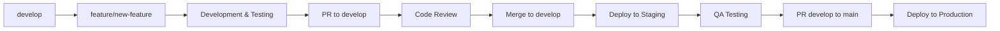

# StarForgeFrontier - Git Branching Strategy

## Overview
This document outlines the Git branching strategy for StarForgeFrontier development. Our approach follows GitFlow principles adapted for game development with continuous deployment.

## Branch Types

### 1. Main Branches

#### `main`
- **Purpose:** Production-ready code
- **Protection:** Protected branch, requires PR approval
- **Deployment:** Auto-deploys to production
- **Merge Requirements:**
  - PR approval from team member
  - All CI/CD checks pass
  - No merge conflicts
  - Up-to-date with latest main

#### `develop`
- **Purpose:** Integration branch for ongoing development
- **Protection:** Semi-protected, requires CI/CD checks
- **Deployment:** Auto-deploys to staging environment
- **Usage:** All feature branches merge here first

### 2. Supporting Branches

#### Feature Branches (`feature/[name]`)
- **Naming Convention:** 
  - `feature/multiplayer-combat-system`
  - `feature/ship-customization-ui`
  - `feature/resource-trading-system`
- **Branch From:** `develop`
- **Merge To:** `develop`
- **Lifetime:** Until feature is complete and merged
- **Purpose:** Individual feature development

**Example Workflow:**
```bash
# Create feature branch
git checkout develop
git pull origin develop
git checkout -b feature/weapon-system

# Work on feature
git add .
git commit -m "feat(combat): add basic weapon firing mechanics"

# Push and create PR
git push -u origin feature/weapon-system
gh pr create --title "Add weapon system" --base develop
```

#### Bugfix Branches (`bugfix/[name]`)
- **Naming Convention:**
  - `bugfix/multiplayer-sync-issue`
  - `bugfix/resource-duplication-bug`
  - `bugfix/client-memory-leak`
- **Branch From:** `develop` (for bugs in development) or `main` (for production bugs)
- **Merge To:** Same branch it was created from
- **Purpose:** Non-critical bug fixes

#### Hotfix Branches (`hotfix/[name]`)
- **Naming Convention:**
  - `hotfix/server-crash-fix`
  - `hotfix/critical-security-patch`
  - `hotfix/game-breaking-exploit`
- **Branch From:** `main`
- **Merge To:** Both `main` and `develop`
- **Purpose:** Critical production fixes that can't wait for the next release
- **Process:** Requires immediate review and deployment

#### Chore Branches (`chore/[name]`)
- **Naming Convention:**
  - `chore/update-dependencies`
  - `chore/improve-build-process`
  - `chore/add-linting-rules`
- **Branch From:** `develop`
- **Merge To:** `develop`
- **Purpose:** Maintenance, tooling, and non-functional improvements

## Development Workflow

### 1. Feature Development


### 2. Release Process
1. **Preparation:** All features for release merged to `develop`
2. **Testing:** Staging environment testing completed
3. **Release PR:** Create PR from `develop` to `main`
4. **Review:** Team review of all changes since last release
5. **Merge:** Merge to `main` triggers production deployment
6. **Tagging:** Tag release with semantic version

### 3. Hotfix Process
1. **Branch:** Create hotfix branch from `main`
2. **Fix:** Implement and test the critical fix
3. **Review:** Emergency review process
4. **Deploy:** Merge to `main` for immediate production fix
5. **Backport:** Merge back to `develop` to keep branches in sync

## Commit Message Standards

### Conventional Commits Format
```
<type>(<scope>): <description>

[optional body]

[optional footer(s)]
```

### Types
- **feat:** New feature for the user
- **fix:** Bug fix for the user
- **docs:** Documentation only changes
- **style:** Code formatting changes
- **refactor:** Code change that neither fixes a bug nor adds a feature
- **perf:** Performance improvements
- **test:** Adding missing tests or correcting existing tests
- **chore:** Changes to build process or auxiliary tools

### Scopes (Game Components)
- **game:** Core game mechanics
- **ui:** User interface
- **server:** Backend/server logic
- **client:** Frontend/client logic
- **network:** Networking/multiplayer
- **physics:** Physics engine
- **economy:** Resource/trading system
- **combat:** Combat systems
- **build:** Build system or dependencies

### Examples
```bash
feat(combat): add laser weapon projectile system
fix(network): resolve player position desync issue
docs(api): update WebSocket message documentation
perf(client): optimize rendering loop for better FPS
chore(deps): update express to latest version
```

## Branch Protection Rules

### Main Branch
- Require PR reviews (minimum 1)
- Require status checks to pass
- Require branches to be up to date
- Include administrators in restrictions
- Allow force pushes: ❌
- Allow deletions: ❌

### Develop Branch  
- Require status checks to pass
- Require branches to be up to date
- Allow force pushes: ❌
- Allow deletions: ❌

## Merge Strategies

### Feature to Develop
- **Strategy:** Squash and merge
- **Reason:** Clean commit history, group related changes

### Develop to Main (Releases)
- **Strategy:** Create merge commit
- **Reason:** Preserve branch history for releases

### Hotfix to Main
- **Strategy:** Squash and merge
- **Reason:** Single, clean commit for hotfixes

## Version Tagging

### Semantic Versioning (SemVer)
- **Format:** `vMAJOR.MINOR.PATCH`
- **Example:** `v0.1.0`, `v1.2.3`

### Version Bumping Rules
- **MAJOR:** Breaking changes to game mechanics or API
- **MINOR:** New features, non-breaking changes
- **PATCH:** Bug fixes, patches

### Pre-release Versions
- **Alpha:** `v1.2.0-alpha.1` (very early, unstable)
- **Beta:** `v1.2.0-beta.1` (feature complete, testing)
- **RC:** `v1.2.0-rc.1` (release candidate)

## Automation & CI/CD

### Automated Checks
- **Linting:** ESLint for code quality
- **Testing:** Unit and integration tests
- **Build:** Verify builds complete successfully
- **Security:** Dependency vulnerability scanning

### Deployment Pipeline
```
feature branch → develop → staging deploy
develop → main → production deploy
```

### Branch Cleanup
- Feature branches deleted after merge
- Automated stale branch detection
- Monthly cleanup of old branches

## Best Practices

### Before Creating a Branch
1. Pull latest changes from base branch
2. Ensure clean working directory
3. Use descriptive branch names
4. Link to issue/ticket when possible

### During Development
1. Make atomic commits with clear messages
2. Test changes locally before pushing
3. Keep branches focused and small
4. Rebase feature branches regularly

### Before Merging
1. Ensure all tests pass
2. Update documentation if needed
3. Test integration with develop branch
4. Review your own changes first

### After Merging
1. Delete the feature branch
2. Update local develop branch
3. Verify deployment succeeded
4. Monitor for any issues

## Troubleshooting

### Common Issues

#### Merge Conflicts
```bash
# Update your branch with latest develop
git checkout feature/my-feature
git rebase develop
# Resolve conflicts, then continue
git rebase --continue
```

#### Accidental Commits to Wrong Branch
```bash
# Move commits to correct branch
git log --oneline -n 5  # Find commit hash
git checkout correct-branch
git cherry-pick <commit-hash>
git checkout wrong-branch
git reset --hard HEAD~1  # Remove the commit
```

#### Need to Update Feature Branch
```bash
# Rebase feature branch on latest develop
git checkout feature/my-feature
git rebase develop
# Or merge if rebase causes issues
git merge develop
```

---

**Version:** 1.0.0  
**Last Updated:** 2025-01-09  
**Maintained By:** GitOps Orchestrator Agent